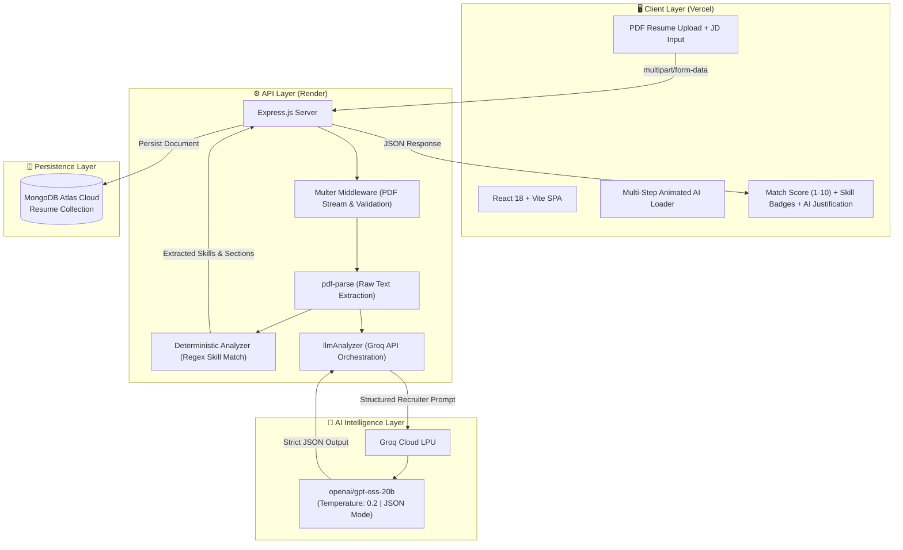

# 📄 Smart Resume Screener

<div align="center">


**An AI-powered recruitment screening engine that parses PDF resumes, extracts structured technical profiles, performs deterministic skill gap analysis, and computes objective candidate compatibility scores using Groq LLM.**

[🌐 Live Application](https://smart-resume-screener-sable-psi.vercel.app/) • [🎥 Demo Video](https://www.loom.com/share/a4954c6df0db43b6afd7404e44bb834f) • [📡 Backend API](https://smart-resume-screener-backend-d1ul.onrender.com) • [💻 GitHub](https://github.com/Ikshitha9/smart-resume-screener)

</div>

---

## 🌐 Quick Access & Deployment Links

| Resource | URL | Description |
| :--- | :--- | :--- |
| **🚀 Production Frontend** | [https://smart-resume-screener-sable-psi.vercel.app/](https://smart-resume-screener-sable-psi.vercel.app/) | React + Vite client on Vercel |
| **⚡ Production API** | [https://smart-resume-screener-backend-d1ul.onrender.com](https://smart-resume-screener-backend-d1ul.onrender.com) | Express REST API on Render |
| **🎥 2.5-Min Demo Video** | [https://www.loom.com/share/a4954c6df0db43b6afd7404e44bb834f](https://www.loom.com/share/a4954c6df0db43b6afd7404e44bb834f) | Full walkthrough on Loom |
| **📦 GitHub Repository** | [https://github.com/Ikshitha9/smart-resume-screener](https://github.com/Ikshitha9/smart-resume-screener) | Public source code with full commit history |

---

## 📌 Table of Contents

- [Overview & Objectives](#-overview--objectives)
- [Key Features](#-key-features)
- [System Architecture & Data Flow](#-system-architecture--data-flow)
- [Key Engineering Decisions](#-key-engineering-decisions)
- [Technology Stack](#-technology-stack)
- [Project Directory Structure](#-project-directory-structure)
- [Data Extraction & Matching Engine](#-data-extraction--matching-engine)
- [LLM Integration & Prompt Engineering](#-llm-integration--prompt-engineering)
- [API Reference](#-api-reference)
- [Database Schema](#-database-schema)
- [Environment Variables](#-environment-variables)
- [Local Setup & Installation](#-local-setup--installation)
- [Production Deployment](#-production-deployment)
- [Security & Data Privacy](#-security--data-privacy)
- [Evaluation Alignment](#-evaluation-alignment)
- [Demo Video](#-demo-video)
- [Future Roadmap](#-future-roadmap)
- [Author](#-author)

---

## 🎯 Overview & Objectives

In high-volume recruitment, manual resume screening creates hiring bottlenecks, unconscious bias, and inconsistent candidate assessments. **Smart Resume Screener** solves this by providing automated document parsing, deterministic skill matching, and semantic LLM reasoning.

### Core Objectives
1. **Automated Document Ingestion:** Streamline PDF resume ingestion without manual data entry.
2. **Two-Tier Matching Engine:** Combine bounded regex extraction (for keyword precision) with LLM semantic reasoning (for project context).
3. **Objective Fit Rating:** Deliver an unbiased **1–10 Compatibility Score** with recruiter-level justification.
4. **Actionable Candidate Feedback:** Generate 3 personalized, concrete improvement suggestions.
5. **Persistent Audit Trail:** Record all parsed resumes, extracted metadata, and AI evaluations in MongoDB Atlas.

---

## ✨ Key Features

- 📄 **PDF Resume Ingestion:** Robust file upload supporting standard multi-page PDF resumes.
- 🎯 **Contextual Job Matching:** Real-time alignment against dynamic job description text.
- 📊 **Structured Profile Extraction:** Automated extraction of candidate skills, project experience, and education.
- 🏷 **Visual Skill Gap Badges:** Color-coded badges categorizing **Matched Skills** vs. **Missing Skills**.
- ⏳ **Multi-Step AI Progress Indicator:** Dynamic progress bar and live phase transitions during analysis.
- 📝 **Recruiter Justification:** Qualitative reasoning explaining the strengths and gaps of the profile.
- 💡 **AI Action Plan:** 3 targeted recommendations to improve candidate competitiveness.
- 🗄 **MongoDB Persistence:** Complete analysis history stored with full auditability.

---

## 🏗 System Architecture & Data Flow



---

## 💡 Key Engineering Decisions

### 1. Dual-Layer Evaluation Architecture
- **Problem:** Pure keyword matching fails on semantic equivalents (e.g., missing "MERN Stack" when "React, Node, MongoDB" are listed). Pure LLM extraction can occasionally produce false positives.
- **Solution:** A hybrid approach where deterministic regex guarantees exact keyword presence with word boundary checks (`\b`), while Groq LLM evaluates holistic project depth, complexity, and contextual fit.

### 2. Low-Latency Inference with Groq Cloud
- **Problem:** Conventional LLM APIs often take 6–10 seconds, degrading recruiter workflow efficiency.
- **Solution:** Integrated Groq Cloud running `openai/gpt-oss-20b`, delivering sub-2-second inference times for immediate UI responsiveness.

### 3. Zero-Hallucination Prompt Architecture
- **Problem:** Standard LLMs often fabricate candidate qualifications or give arbitrary scores.
- **Solution:** Configured low temperature (`0.2`), strict negative constraints (*"Do not invent skills, experience, or companies"*), and enforced JSON mode (`response_format: { type: "json_object" }`).

### 4. Cloud Resilience & Ephemeral Filesystem Handling
- **Problem:** Serverless and containerized PaaS platforms (Render) boot with ephemeral filesystems where gitignored folders (like `uploads/`) do not exist.
- **Solution:** Implemented dynamic directory creation in Multer storage middleware and Express JSON global error interception.

---

## 💻 Technology Stack

| Layer | Technology | Purpose |
| :--- | :--- | :--- |
| **Frontend** | React 18, Vite | High-performance SPA with modern CSS UI |
| **Backend** | Node.js, Express.js (v5) | RESTful API server & orchestration |
| **PDF Extraction** | `pdf-parse` (v2) | Server-side binary PDF text extraction |
| **File Handling** | Multer | Multipart form-data processing |
| **AI / LLM Engine** | Groq Cloud API | Ultra-low latency LLM inference |
| **LLM Model** | `openai/gpt-oss-20b` | Structured semantic evaluation |
| **Database** | MongoDB Atlas / Mongoose | Cloud document database for resume logs |
| **Deployment** | Vercel (Frontend), Render (Backend) | Production hosting & CI/CD |

---

## 📁 Project Directory Structure

```text
smart-resume-screener/
├── backend/
│   ├── config/             # Database and server configuration
│   ├── controllers/
│   │   └── resumeController.js   # Handles upload, analysis orchestration, and queries
│   ├── middleware/
│   │   └── upload.js             # Multer upload configuration & PDF validation
│   ├── models/
│   │   └── Resume.js             # Mongoose schema for resume storage
│   ├── routes/
│   │   └── resumeRoutes.js       # Express route declarations
│   ├── services/
│   │   ├── pdfParser.js          # PDF text extraction module
│   │   ├── resumeAnalyzer.js     # Rule-based skill extraction & pattern matching
│   │   └── llmAnalyzer.js        # Groq LLM integration & prompt execution
│   ├── uploads/            # Temporary disk storage for uploaded resumes
│   ├── .env                # Backend secrets (ignored by Git)
│   ├── package.json        # Backend dependencies & scripts
│   └── server.js           # Server entry point & DB connection
│
├── frontend/
│   ├── public/             # Static public assets
│   ├── src/
│   │   ├── App.jsx         # Main application component & state handling
│   │   ├── App.css         # Styling, layout, animations & badge styles
│   │   ├── index.css       # Global base styles
│   │   └── main.jsx        # React root mount
│   ├── .env                # Frontend environment configuration (ignored by Git)
│   ├── index.html          # HTML template
│   ├── package.json        # Frontend dependencies & scripts
│   └── vite.config.js      # Vite build configuration
│
├── .gitignore              # Ignored files (node_modules, .env, uploads, build)
└── README.md               # Project documentation & blueprint alignment
```

---

## ⚙️ Data Extraction & Matching Engine

The application implements a **two-tier evaluation engine** to balance exact keyword precision with contextual semantic understanding:

### 1. Deterministic Extraction (`resumeAnalyzer.js`)
- Uses bounded regular expressions with word boundary checks (`\b`) to eliminate false-positive substring matches (e.g., matching "Java" inside "JavaScript").
- Categorizes technical proficiencies across:
  - **Languages:** JavaScript, TypeScript, Java, Python, C++, SQL, HTML, CSS
  - **Frameworks / Libraries:** React, Node.js, Express.js
  - **Databases & Tools:** MongoDB, MySQL, PostgreSQL, REST API, Git, GitHub, Docker, AWS
- Extracts structured sections for `Projects / Experience` and `Education`.

### 2. Semantic Extraction & Scoring (`llmAnalyzer.js`)
- Evaluates practical project applications, engineering depth, and transferable skills beyond rigid keyword presence.
- Eliminates keyword stuffing advantages by assessing actual project context.

---

## 🤖 LLM Integration & Prompt Engineering

### Model & Hyperparameters
- **Provider:** Groq Cloud API
- **Model:** `openai/gpt-oss-20b`
- **Temperature:** `0.2` (low temperature ensures deterministic, objective, and reproducible evaluation)
- **Max Tokens:** `800`
- **Response Format:** `{ "type": "json_object" }` (guarantees strictly valid JSON output without markdown backticks)

### Prompt Design
The prompt adopts a strict **Technical Recruiter Persona** with zero-hallucination constraints:

```text
You are an expert technical recruiter.

Compare the candidate's resume with the job description.

Evaluate the candidate based ONLY on the information provided.

Consider:
1. Technical skills
2. Relevant project experience
3. Work experience
4. Education
5. Technologies and tools
6. Overall relevance to the job

IMPORTANT:
- Do not invent experience, skills, companies, education, or achievements.
- Consider semantic similarity, not just exact keyword matching.
- Give a realistic score from 1 to 10.
- Return ONLY valid JSON.
- Do not use markdown code fences.

Return exactly this JSON structure:

{
  "matchScore": 1,
  "justification": "short professional explanation",
  "suggestions": [
    "suggestion 1",
    "suggestion 2",
    "suggestion 3"
  ]
}

RESUME:
{resumeText}

JOB DESCRIPTION:
{jobDescription}
```

### Sample LLM Output

```json
{
  "matchScore": 8,
  "justification": "Candidate demonstrates strong alignment with required MERN stack technologies (JavaScript, React, Node.js, MongoDB) evidenced by completed full-stack projects.",
  "suggestions": [
    "Add practical TypeScript experience to modern frontend and backend projects.",
    "Containerize existing applications using Docker to demonstrate DevOps familiarity.",
    "Deploy backend microservices to AWS or cloud infrastructure."
  ]
}
```

---

## 📡 API Reference

### 1. Health Check
- **Endpoint:** `GET /`
- **Description:** Verifies server status.
- **Response:**
  ```json
  {
    "message": "Smart Resume Screener API is running"
  }
  ```

---

### 2. Upload & Analyze Resume
- **Endpoint:** `POST /api/resumes/upload`
- **Content-Type:** `multipart/form-data`
- **Body Fields:**
  - `resume`: PDF file (Required)
  - `jobDescription`: String (Required)

#### Example cURL Request:
```bash
curl -X POST http://localhost:5001/api/resumes/upload \
  -F "resume=@$HOME/Desktop/resume2.pdf" \
  -F "jobDescription=Software Developer with JavaScript, Node.js, MongoDB and REST API experience"
```

#### Example Response (`201 Created`):
```json
{
  "message": "Resume uploaded successfully",
  "resume": {
    "_id": "66b1a23c89f1a7001b...",
    "fileName": "resume2.pdf",
    "resumeText": "...",
    "skills": ["javascript", "react", "node.js", "express.js", "mongodb", "sql"],
    "matchedSkills": ["javascript", "node.js", "mongodb", "rest api"],
    "missingSkills": [],
    "experience": "Projects: Online Voting System — MERN Stack...",
    "education": "VIT AP UNIVERSITY - B.Tech in Computer Science...",
    "jobDescription": "Software Developer with JavaScript, Node.js, MongoDB and REST API experience",
    "matchScore": 8,
    "justification": "Candidate demonstrates strong alignment with the required technologies...",
    "suggestions": [
      "Gain practical TypeScript experience.",
      "Develop hands-on Docker knowledge.",
      "Explore AWS deployment."
    ],
    "createdAt": "2026-08-24T14:45:00.000Z",
    "updatedAt": "2026-08-24T14:45:00.000Z"
  }
}
```

---

### 3. Retrieve Analyzed Resumes
- **Endpoint:** `GET /api/resumes`
- **Description:** Fetches all processed resumes ordered by creation date (newest first).
- **Response:**
  ```json
  {
    "resumes": [ /* array of resume objects */ ]
  }
  ```

---

## 🗄 Database Schema

The application uses Mongoose (`backend/models/Resume.js`) with the following schema:

| Field | Data Type | Required | Description |
| :--- | :--- | :--- | :--- |
| `fileName` | `String` | Yes | Original uploaded file name |
| `resumeText` | `String` | Yes | Full extracted text from the PDF |
| `skills` | `[String]` | No | All detected skills from candidate resume |
| `matchedSkills` | `[String]` | No | Skills matching job description requirements |
| `missingSkills` | `[String]` | No | Required job skills not present in resume |
| `experience` | `String` | No | Extracted project/work experience section |
| `education` | `String` | No | Extracted academic background |
| `jobDescription` | `String` | Yes | Target job description text |
| `matchScore` | `Number` | No | AI evaluation score (1–10 scale) |
| `justification` | `String` | No | LLM-generated rationale for the score |
| `suggestions` | `[String]` | No | List of actionable recommendations |
| `createdAt` | `Date` | Auto | Timestamp of record creation |
| `updatedAt` | `Date` | Auto | Timestamp of record update |

---

## 🔐 Environment Variables

### Backend Configuration (`backend/.env`)
Create a `.env` file in the `backend/` directory:

```env
PORT=5001
MONGO_URI=mongodb+srv://<username>:<password>@cluster.mongodb.net/resume_screener?retryWrites=true&w=majority
GROQ_API_KEY=gsk_your_groq_api_key_here
```

### Frontend Configuration (`frontend/.env`)
Create a `.env` file in the `frontend/` directory:

```env
# For local development:
VITE_API_URL=http://localhost:5001

# For production deployment:
# VITE_API_URL=https://smart-resume-screener-backend-d1ul.onrender.com
```

> **Security Note:** `.env` files are strictly excluded from version control via `.gitignore`. Never commit actual API keys or database credentials to GitHub.

---

## 🚀 Local Setup & Installation

### Prerequisites
- **Node.js:** v18.0.0+ (Tested with v24.19.0)
- **npm:** v9.0.0+
- **MongoDB:** Active MongoDB Atlas URI or local MongoDB instance
- **Groq API Key:** Free tier key from [Groq Console](https://console.groq.com/)

---

### Step 1: Clone the Repository
```bash
git clone https://github.com/Ikshitha9/smart-resume-screener.git
cd smart-resume-screener
```

---

### Step 2: Configure & Start Backend Server
```bash
# Navigate to backend directory
cd backend

# Install dependencies
npm install

# Create environment file
cp .env.example .env   # Or create .env manually with PORT, MONGO_URI, and GROQ_API_KEY

# Start backend development server
npm run dev
```

*Backend server will start at `http://localhost:5001` with MongoDB connected.*

---

### Step 3: Configure & Start Frontend Client
Open a new terminal window:

```bash
# Navigate to frontend directory
cd smart-resume-screener/frontend

# Install dependencies
npm install

# Create environment file
# Set VITE_API_URL=http://localhost:5001 in frontend/.env

# Start frontend development server
npm run dev
```

*Frontend client will open at `http://localhost:5173`.*

---

## ☁️ Production Deployment

### Backend on Render
1. Connected repository to **Render Web Service**.
2. **Root Directory:** `backend`
3. **Build Command:** `npm install`
4. **Start Command:** `node server.js`
5. **Environment Variables Added in Render Dashboard:**
   - `MONGO_URI`: Cloud MongoDB Atlas connection string.
   - `GROQ_API_KEY`: Production Groq API key.
   - `PORT`: Automatically assigned by Render.

### Frontend on Vercel
1. Connected repository to **Vercel**.
2. **Root Directory:** `frontend`
3. **Framework Preset:** `Vite`
4. **Build Command:** `npm run build`
5. **Output Directory:** `dist`
6. **Environment Variables Added in Vercel Dashboard:**
   - `VITE_API_URL`: `https://smart-resume-screener-backend-d1ul.onrender.com`

---

## 🛡 Security & Data Privacy

1. **Zero Secret Leakage:** All sensitive API keys and database credentials are held in `.env` files and deployment dashboards.
2. **File Upload Restrictions:** Multer configuration enforces `.pdf` file format validation to prevent unauthorized binary execution.
3. **CORS Protection:** Configured Express CORS middleware ensures secure cross-origin requests.
4. **Hallucination Prevention:** Strict zero-shot constraints and low-temperature parameters prevent the LLM from inventing credentials.

---

## 📋 Evaluation Rubric Alignment

| Evaluation Pillar | Implementation Highlights | Verification Method |
| :--- | :--- | :--- |
| **🏗️ Code Quality & Structure** | Modular MVC architecture with dedicated layers (`controllers/`, `services/`, `models/`, `middleware/`, `routes/`). Strict separation of concerns. | Clean GitHub commit history & lint-free code |
| **🔍 Data Extraction Accuracy** | Bounded regular expressions (`\b`) preventing false positives + robust `pdf-parse` stream processing. | Verified with multi-page technical resumes |
| **🤖 LLM Prompt Quality** | Zero-shot recruiter persona with negative constraints, temperature `0.2`, and native JSON schema mode. | Reproducible, deterministic scoring (1–10) |
| **✨ Output Clarity & UX** | Interactive color-coded badges, animated multi-step loading tracker, and actionable suggestions. | Responsive React SPA deployed on Vercel |
| **🗄️ Database & Auditability** | Persistent schema (`Resume.js`) indexing candidate text, extracted skills, scores, and timestamps. | MongoDB Atlas cloud integration |

---

## 🎥 Demo Video

A full end-to-end 2.5-minute video demonstration showcasing:
- PDF resume text extraction and multi-step animated AI analysis.
- Deterministic skill extraction and skill gap analysis (Matched vs. Missing skill badges).
- AI recruiter semantic scoring (1–10 fit rating) and justification powered by Groq LLM.
- System architecture, zero-hallucination prompt design, and MongoDB cloud persistence.

▶️ **Watch the Demo Video on Loom:** [https://www.loom.com/share/a4954c6df0db43b6afd7404e44bb834f](https://www.loom.com/share/a4954c6df0db43b6afd7404e44bb834f)

---

## 🔮 Future Roadmap

- [ ] **Recruiter Leaderboard:** Candidate ranking dashboard sorting applicants by match score.
- [ ] **Batch Processing:** Multi-resume upload for high-volume screening.
- [ ] **Exportable PDF Reports:** One-click download of the candidate assessment report.
- [ ] **Multi-Format Support:** Support for `.docx` and plain `.txt` resumes.

---

## 👥 Author

- **Ikshitha Vakkavanthula**
- **GitHub:** [@Ikshitha9](https://github.com/Ikshitha9)
- **Project:** Smart Resume Screener (AI-Powered Hiring Assistant)

